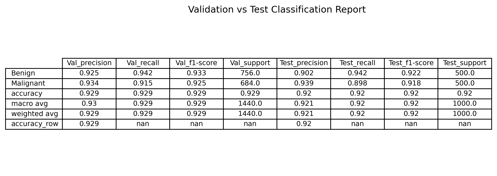
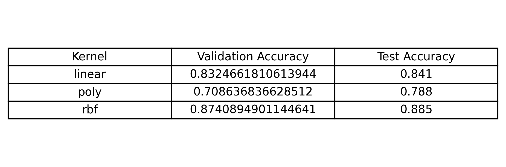
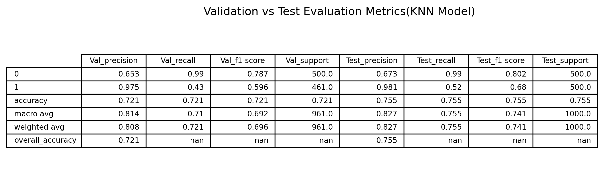
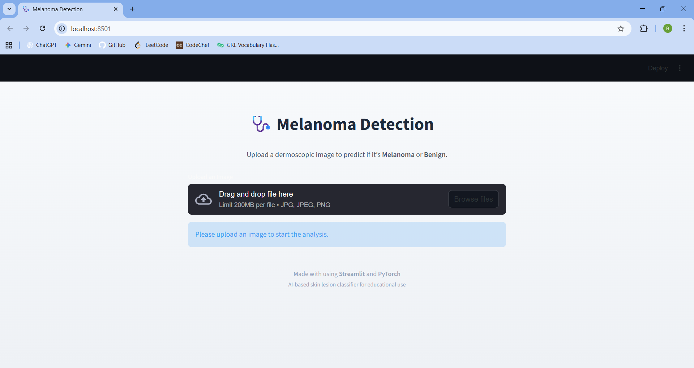
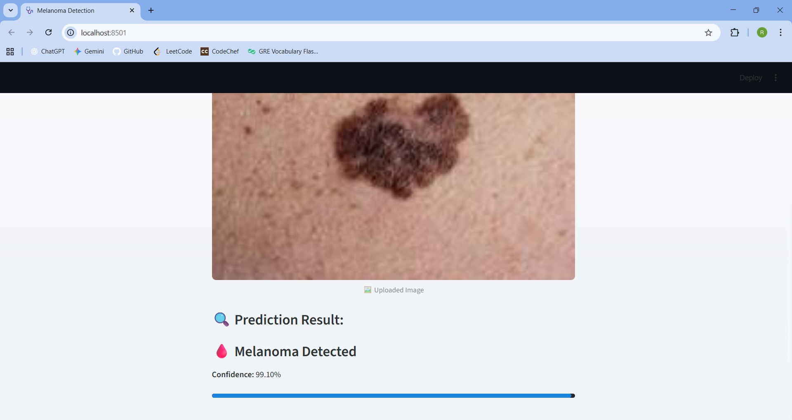
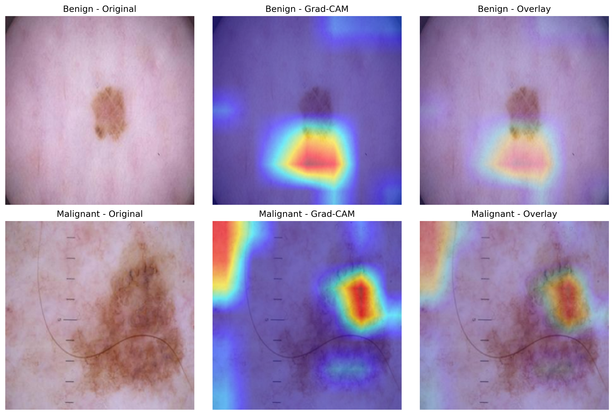

# Melanoma Detection System

A deep learning–based project that detects **melanoma (skin cancer)** from dermoscopic images using **ResNet50**, and compares its performance with traditional ML models like **SVM** and **KNN**.  

This project leverages **transfer learning**, **Grad-CAM explainability**, and **automated data handling** from Kaggle datasets.

---
## Project Structure
```
Melanoma_Detection/
├── model/
│   └── resnet50_melanoma_best.pth          # Trained ResNet50 model
├── screenshots/                            # Results and visual comparisons
├── app.py                                  # Streamlit app for model demo
├── Melanoma_Detection_CNN.ipynb            # CNN model notebook
├── Melanoma_Detection_KNN.ipynb            # KNN model notebook
├── Melanoma_Detection_SVM.ipynb            # SVM model notebook
├── requirements.txt                        # Dependencies
├── LICENSE
├── Readme.md
└── venv/
````

---

## Dataset

Dataset used:  
**[Melanoma Skin Cancer Dataset of 10,000 Images](https://www.kaggle.com/datasets/hasnainjaved/melanoma-skin-cancer-dataset-of-10000-images)**  

It contains:
- **Benign** images (non-cancerous)
- **Malignant** images (cancerous)

The script automatically downloads and unzips the dataset using Kaggle API credentials.

---

## Model Architecture

### 1. Deep Learning (CNN — ResNet50)
- **Base Model:** Pretrained ResNet50 (`torchvision.models`)
- **Transfer Learning:** Frozen convolutional base → trained classifier head
- **Fine-Tuning:** Last two ResNet blocks unfrozen for domain adaptation
- **Loss:** Binary Cross-Entropy with Logits
- **Optimizer:** AdamW with learning rate scheduling
- **Explainability:** Grad-CAM visualizations for benign and malignant predictions

### 2. Classical ML Models
- **SVM (Support Vector Machine):** Trained on extracted CNN features
- **KNN (K-Nearest Neighbors):** Compared for baseline accuracy

---

## Model Comparison

Below are the comparison results of the three models — **ResNet50 (CNN)**, **SVM**, and **KNN** — based on their performance metrics and output visualizations.

### ResNet50 (CNN)


### SVM


### KNN


---


## Training Pipeline

1. **Dataset download & preparation**
2. **Data augmentation** (rotation, flipping, color jitter, blur)
3. **Stage 1:** Train classification head
4. **Stage 2:** Fine-tune deeper layers (layer3 & layer4)
5. **Evaluation:** Validation and test sets
6. **Grad-CAM:** Generate heatmaps for explainability

---


## Installation

```bash
# Clone the repository
git clone https://github.com/02priyeshraj/Melanoma_Detection_System.git
cd Melanoma_Detection

# Create virtual environment
python -m venv venv
venv\Scripts\activate  # or source venv/bin/activate on MacOS

# Install dependencies
pip install -r requirements.txt

# Run the application
streamlit run app.py
````

---

## 🖼Results Overview

Below are the key visuals of the **Melanoma Detection System**, including the web interface, prediction output, and Grad-CAM visualization.

### Website Interface


### Prediction Result


### Grad-CAM Visualization


---


## Key Insights

* Transfer learning with **ResNet50** achieves superior accuracy compared to classical ML models.
* Grad-CAM provides **visual explainability**, enhancing clinical trust.
* Extensive **data augmentation** prevents overfitting on limited samples.

---

## Future Improvements

* Add multi-class classification to detect various skin lesion types beyond melanoma.
* Integrate real-time webcam upload for instant predictions via web or mobile.
* Implement model quantization for lightweight edge deployment.

---

## License

This project is licensed under the **MIT License** — see the [LICENSE](LICENSE) file for details.

---


